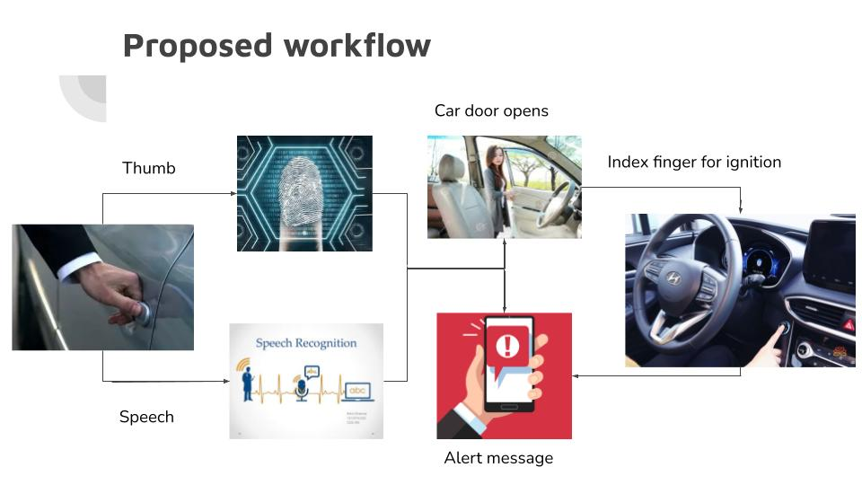

# Smart Vehicle Security System

In modern day vehicles, vehicle anti-theft system is of prime importance. The vehicle anti-theft system presented here consists of multiple layers of protection with one complementing the other. The first layer of protection in the system is a Fingerprint recognition, based on which the doors are opened. Also a speech recognition system is used as another verification of the identity of the owner. If the owner is found then the car door opens. When the user enters the car, the second layer comes into picture, for ignition the user has to place his/her index finger. If the system detects discrepancy,an alert message is sent to the mobile number of the owner with the details of the vehicles’ location. 
The proposed security system can be applied to any vehicle to prevent theft/damage to the vehicle.

# Workflow:

Execution:
Exceute fingerprint.ipynb file
Change parameters given to main() to check different fingerprint images.Images are available in database folder. 
Speech Recognition module, password can be set per user needs.
